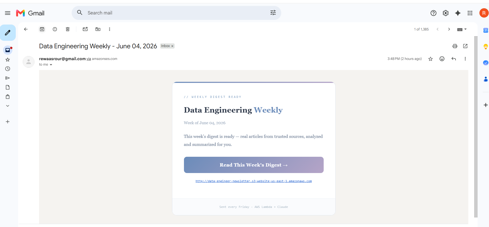
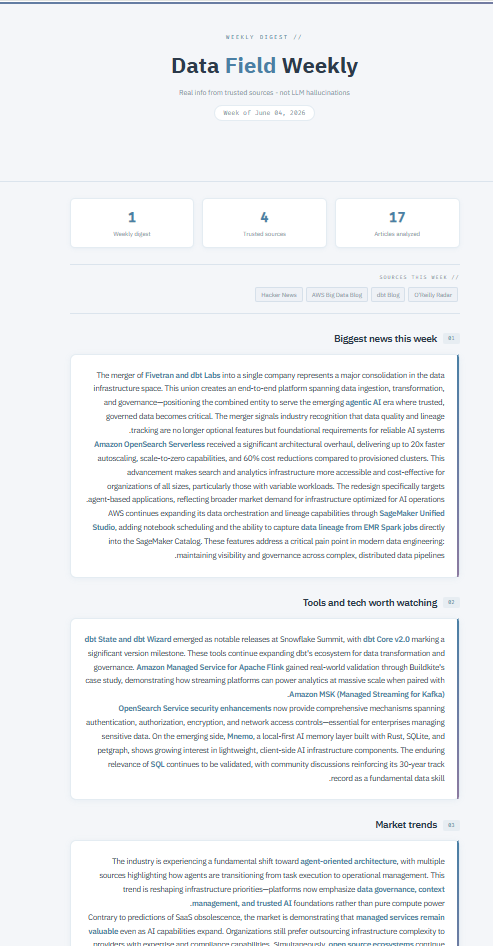
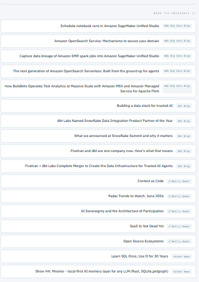
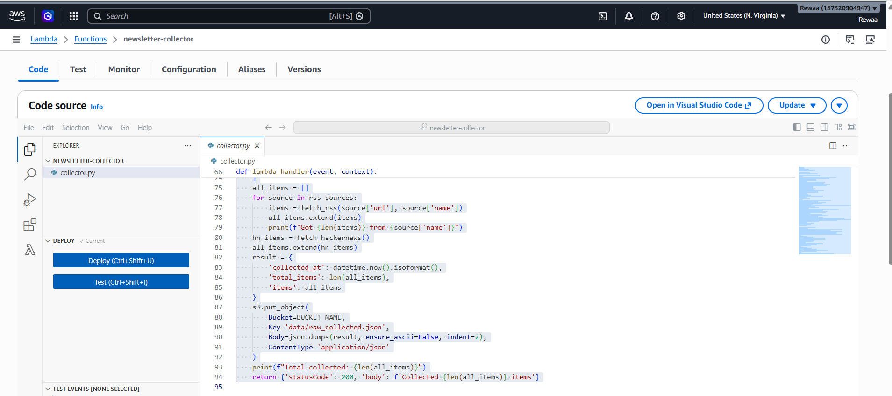
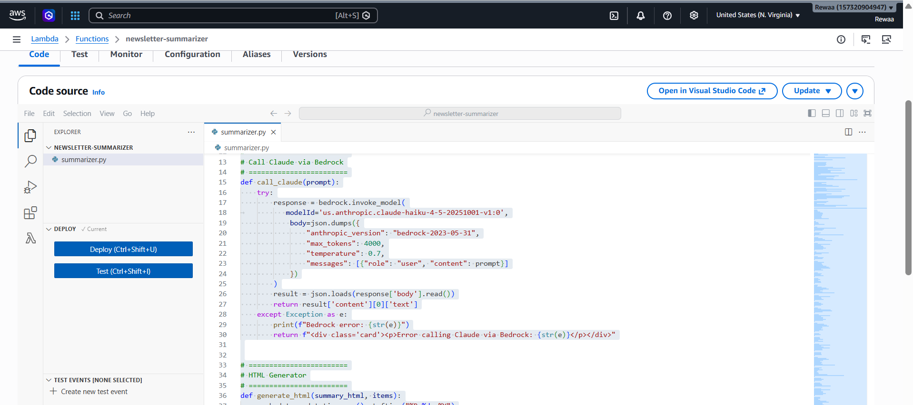
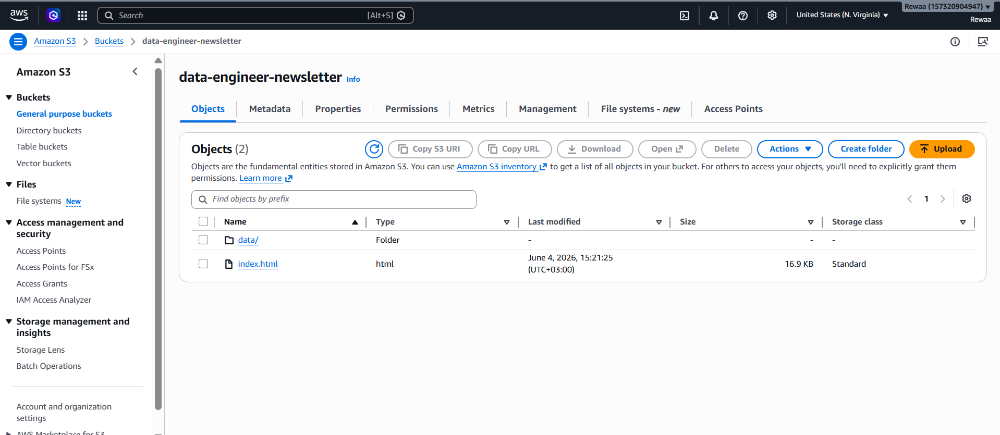
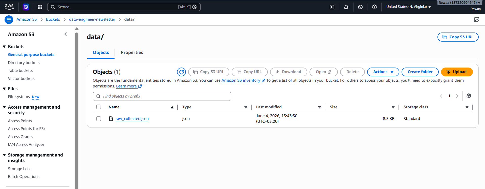

# Serverless AI Newsletter Pipeline

An automated pipeline that runs every Friday. It collects news from the data field — like pipelines, warehousing, analytics, and tools — then sends everything to Claude to summarize it, and finally delivers a clean HTML newsletter to my inbox.

No manual work at all.

Everything is built using AWS serverless services.

---

## The Problem I Was Trying to Solve

Keeping up with the data field is not easy. Every week there are new tools, blog posts, Hacker News stories, and updates from different companies.

I wanted something simple that collects all of this for me and sends a short summary every Friday morning.

---

## How It Works

The system uses three AWS Lambda functions. They run every Friday using EventBridge.

### 1. Controller Lambda  
This function collects articles from different sources. It uses 6 RSS feeds like AWS Big Data Blog, dbt Blog, Netflix Tech Blog, LinkedIn Engineering, Astronomer, and O’Reilly Radar.

It also gets top stories from Hacker News and filters them using keywords like Kafka, Spark, Airflow, dbt, SQL, and analytics.

All the data is saved in an S3 bucket as a JSON file.

---

### 2. Summarizer Lambda  
This function reads the data from S3 and sends it to Claude (via Amazon Bedrock).

Claude creates a full HTML newsletter from the data. The newsletter has 5 parts:
- Biggest news this week  
- Tools worth watching  
- Market trends  
- Deep dive of the week  
- Practical takeaways  

The final HTML is saved in S3 as a static website (index.html).

---

### 3. Notifier Lambda  
This function sends an email using Amazon SES.

The email includes a link to the newsletter, so I can open it with one click.

---

## Architecture

(EventBridge → Controller Lambda → S3 → Summarizer Lambda (Bedrock / Claude) → S3 Static Website → SES Email)

---

## Stack

| Service | What it does |
|---|---|
| AWS Lambda (Python) | Runs all the functions |
| Amazon S3 | Stores raw data and hosts the website |
| Amazon Bedrock (Claude Haiku) | Summarizes and generates the newsletter |
| Amazon SES | Sends email notifications |
| Amazon EventBridge | Triggers the pipeline every Friday |

---

## Screenshots

### Email Notification


### Newsletter Website



### Lambda Functions



### S3 Bucket



----


### Project Structure

```text
serverless-ai-newsletter-pipeline/
├── controller_lambda/
│   └── lambda_function.py        # Collects RSS feeds + Hacker News data
├── summarizer_lambda/
│   └── lambda_function.py        # Sends data to Claude (Bedrock) and generates HTML
├── notifier_lambda/
│   └── lambda_function.py        # Sends email via SES
├── data/
│   └── raw_collected.json        # Raw collected data from S3
├── screenshots/
│   ├── Mail.png
│   ├── Website_1.png
│   ├── Website_2.png
│   ├── Collector_Lambda.png
│   ├── Summarizer_Lambda.png
│   ├── S3_Bucket.png
│   └── Json_File_S3_Bucket.png
├── architecture/
│   └── architecture.png          # AWS system design diagram
└── README.md
